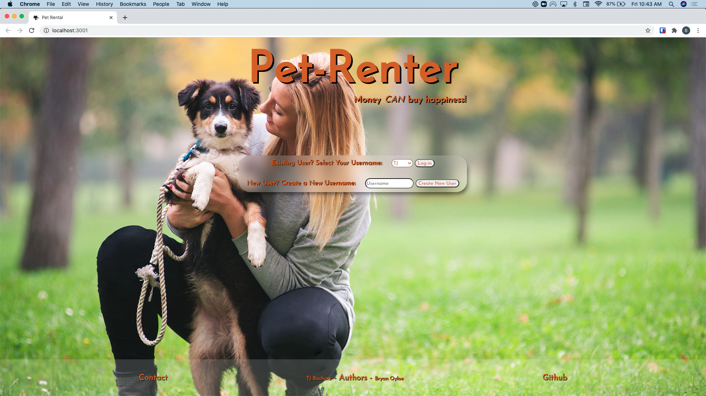

# Welcome to Pet-Rental!
### Setup
> -Clone [backend](https://github.com/TJBachorz/Pet-Rental-back-end) and [frontend](https://github.com/boyloe/Pet-rental-front-end) repos to your local computer
>
> -Open backend and run `bundle install`
>
> -Run `rails db:migrate` and then `rails db:seed`
>
> -Get your back-end running by running `rails s`
> 
> -Open front-end and run `lite-server`

### About
> Have you ever wanted to own a cat or dog, but only for a day or two? Well, then Pet-Rental is the app for you!
>If this is your first time using Pet-Rental, create a new account by typing your name into the text bar and clicking on the 'Create new user' button.

### Home Page

>
> Once you have logged in, you will be taken to your personal "User" page which will display all the pets you have rented in the past. If you have not previously
> used Pet-Rental, you will be invited to rent your first pet. 
>Clicking on the link will bring you to our "Pets" page where you can select the animal that you want to rent. 
>
### User Page

>
### Pets Page

>
>Click on the picture of your favorite cat or dog and you will be shown all of the information for that animal and be able to select the dates that you want
> want to enjoy your furry friend. Pick your dates and click on "Rent This Pet" and your reservation will be complete!
### Rental Page

### [License Information](https://www.termsfeed.com/live/31cbacda-3fe3-4b0c-adf3-c6ca250f4744)
